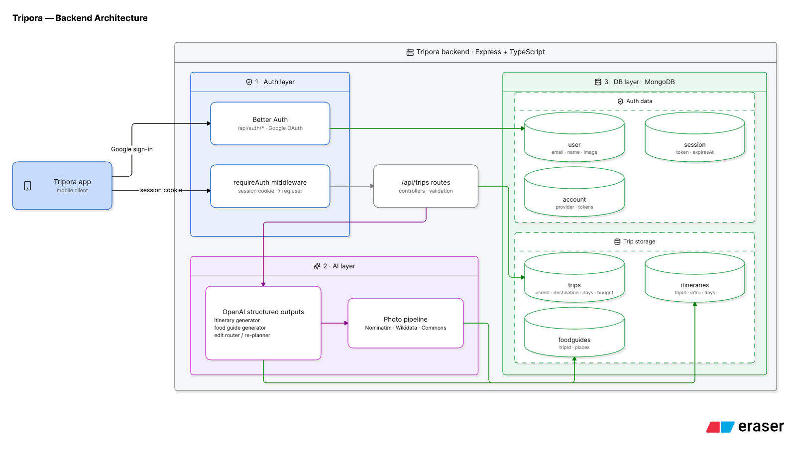

# Tripora backend

REST API for **Tripora, an AI travel planner**. Node + Express + TypeScript + MongoDB (Mongoose) + OpenAI.

The mobile app lives in the [Tripora repo](https://github.com/) <!-- TODO: link Tripora app repo -->.

## What it does

- **Auth** — Google sign-in via Better Auth, mounted at `/api/auth/*`.
- **Trips** — `/api/trips`: per-user CRUD plus a chat-edit endpoint.
- **AI generation** — itineraries and food guides are generated in the background (`gpt-5-mini`, OpenAI structured outputs with strict JSON schemas), so saving a trip responds instantly; each lives in its own collection keyed by `tripId`, and its absence is the "still generating" state.
- **Chat edits** — a small classifier call routes each message to the itinerary editor or the food-guide editor; edits are surgical and return a note describing the change.
- **Free place photos** — Nominatim geocoding → OSM entity tags → Wikidata/Commons image → geotagged Commons photos near the coordinates as fallback, throttled to 1 req/s with a relevance check.

## Architecture



## Setup

```bash
npm install
cp .env.example .env   # fill in the values below
npm run dev            # nodemon + tsx on port 3000
```

| Env var | Purpose |
| --- | --- |
| `MONGODB_URI` | MongoDB / Atlas connection string |
| `BETTER_AUTH_SECRET` | `openssl rand -base64 32` |
| `BETTER_AUTH_URL` | `http://localhost:3000` |
| `GOOGLE_CLIENT_ID` / `GOOGLE_CLIENT_SECRET` | Google OAuth web client (redirect URI `http://localhost:3000/api/auth/callback/google`) |
| `OPENAI_API_KEY` | itinerary + food generation |

Other commands: `npm run typecheck`, `npm run build`, `npm start`. Health check: `curl http://localhost:3000/health`.

## Layout

- `src/index.ts` — entry point: connects MongoDB, starts the server
- `src/app.ts` — Express app: auth mount, routes, 404 + error handlers
- `src/auth.ts` — Better Auth (Google sign-in, MongoDB adapter)
- `src/ai/client.ts` — shared OpenAI structured-output helper + edit-intent router
- `src/ai/itinerary.ts` — itinerary generator + chat editor
- `src/ai/food.ts` — food guide generator + chat editor
- `src/places.ts` — free place-photo pipeline (throttled)
- `src/models/` — `trip`, `itinerary`, `food` schemas
- `src/routes/trips.ts` — `/api/trips` CRUD + chat edit (session-protected)
